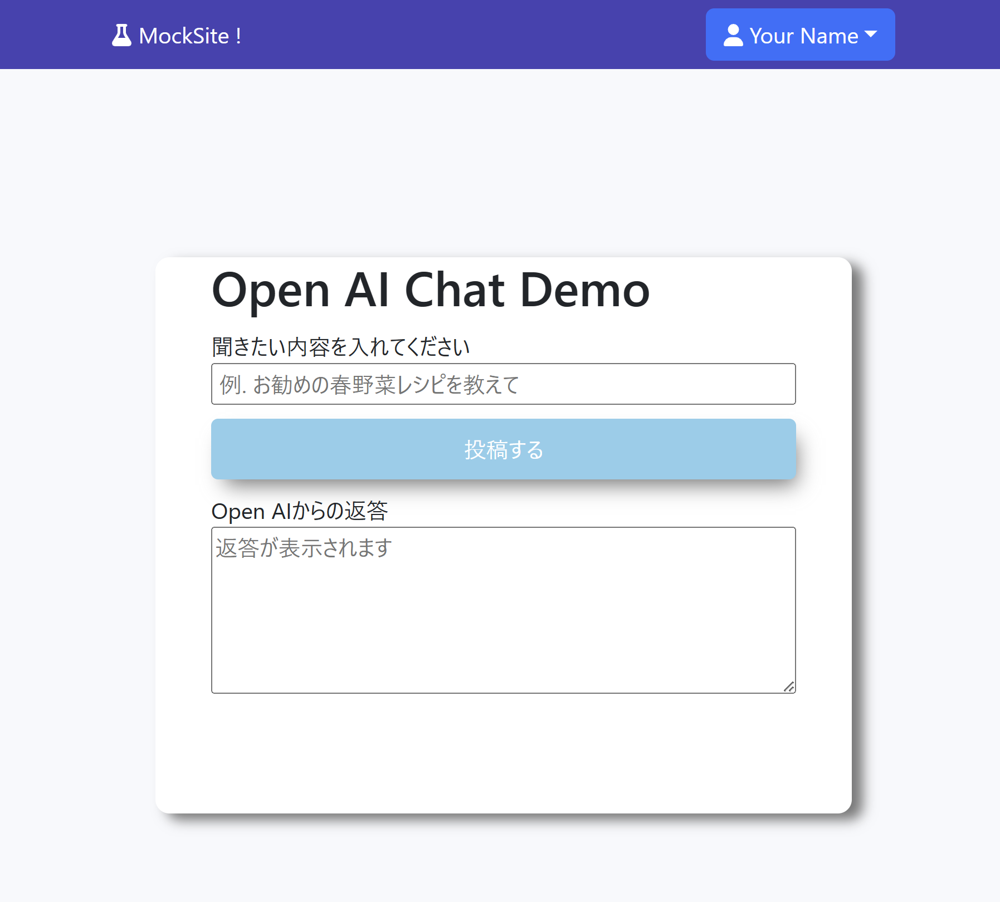
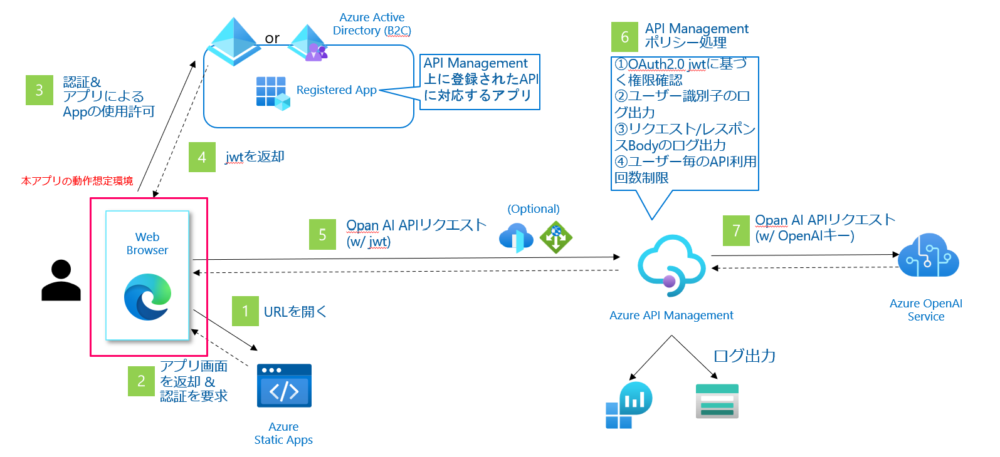

English follows

# このリポジトリについて




* このリポジトリはAzure AD認証に基づいてAzure Open AIを叩くAPIのreactで実装されたデモである
https://github.com/mizti/azure-openai-react-sample
をAPI Management経由でのリクエスト / Azure OpenAI OAuth2.0形式に改修したデモです

* Azure ADで認証したログインのユーザーの権限でAzure Open AIを利用します

# 構成概要



# 環境: 

* nodejs 16以上
* npm 8以上

# 利用方法

## Azure上の準備

### 1. AzureADでアプリの登録

Azureポータルにログインし、「アプリの登録」> 「新規登録」
任意の名前を付け、サポートされているアカウントの種類でシングルテナントを選択します。
リダイレクトURIでは種類でSPAを選択し、ローカルで動かす場合はhttp://localhost:3000、リモートサーバ上で動かす場合には適宜そのサーバのドメインを指定します。

### 2. 登録アプリへの公開API登録

作成されたアプリの「APIの公開」を選択し、スコープを追加します。スコープ名に適当な値（以下の例では「chat」とします）を指定し、同意できるのは「管理者とユーザー」、その他の項目は適宜投入し「スコープの追加」を押下します。

### 3. Azure Open AI, APIM等バックエンド環境のデプロイ
別途のIaC（公開予定）を用いてAPI Management + Azure OpenAIの環境を構築します

ここまででAzure上の準備は完了です。

## ご利用方法

1. 本リポジトリをClone後、.envファイルを以下のように適宜環境に合わせて書き換えてください。

|  変数名  |  変数の内容 |
| ---- | ---- |
|REACT_APP_CLIENT_ID  |Azure ADに登録したアプリのクライアントID  |
|REACT_APP_TENANT_ID  |Azure ADのディレクトリ(テナント)ID  |
|REACT_APP_REDIRECT_URL  |リダイレクト先に指定したURL  |
|REACT_APP_APIM_SCOPE|JWT取得対象のスコープ名|
|REACT_APP_OPEN_AI_SUBDOMAIN  |**Azure Management**の名前(=サブドメイン)  |
|REACT_APP_OPEN_AI_MODEL_NAME  |デプロイしたモデルの名前(選択したモデル名ではなく自分でつけた名前)  |
|REACT_APP_OPEN_AI_API_VERSION  |Azure OpenAIのAPIバージョン  |
|REACT_APP_APIM_SUBSCRIPTION_KEY|API Managementアクセス用のサブスクリプションキー|


2. パッケージのインストール

```bash
npm install
```

3. 起動

```bash
npm start
```

# その他

* 手順通りにやったけど動かない等の困りごとはお気軽にIssueまで
* 本リポジトリの内容は個人的な見解であり、所属する会社、組織とは全く関係ありません
* 当リポジトリの内容は保証/責任は一切負いません。自己責任でご利用ください


-------------

-----
# About this Repository


* This repository contains a demo implemented in React for an API that calls Azure Open AI based on Azure AD authentication. It is a revised version of the demo at https://github.com/mizti/azure-openai-react-sample to accommodate requests via API Management / Azure OpenAI OAuth2.0 format.

* Azure Open AI is used under the authority of the users who authenticated with Azure AD.

# Architecture Overview


# Environment:

* Node.js 16 or higher
* npm 8 or higher

# Usage

## Preparations on Azure

### 1. Register an app in Azure AD

Log in to the Azure portal, go to "App registrations" > "New registration". Give it a name and select "Single tenant" for the supported account types. For the Redirect URI, choose "SPA" and specify "http://localhost:3000" if running locally or the appropriate server domain for remote servers.

### 2. Expose API Registration for the Registered App

Select "Expose an API" for the created app and add a scope. Specify a suitable value for the scope name (we'll use "chat" as an example below), for who can consent select "Admins and users", fill in the other items as appropriate and click "Add a scope".

### 3. Deploy Azure Open AI, APIM, etc. Backend Environment

Use separate IaC (to be published) to build the environment with API Management + Azure OpenAI.

The preparation on Azure is now complete.

## How to use

1. After cloning this repository, update the .env file according to your environment:

|  Variable Name  |  Variable Content |
| ---- | ---- |
|REACT_APP_CLIENT_ID  |Client ID of the app registered in Azure AD  |
|REACT_APP_TENANT_ID  |Directory (Tenant) ID of Azure AD  |
|REACT_APP_REDIRECT_URL  |URL specified as redirect destination  |
|REACT_APP_APIM_SCOPE|Scope name for obtaining JWT|
|REACT_APP_OPEN_AI_SUBDOMAIN  |Name (=subdomain) specified for **Azure API Management**|
|REACT_APP_OPEN_AI_MODEL_NAME  |	Name of the deployed model (not the selected model name, but the name you gave it) |
|REACT_APP_OPEN_AI_API_VERSION  |API version of Azure OpenAI|
|REACT_APP_APIM_SUBSCRIPTION_KEY|Subscription key for accessing API Management|

2. Install packages

```bash
npm install
```

3. Launch

```bash
npm start
```

# Other

* Feel free to open an issue if you have any trouble, such as not working even after following the instructions.

* The contents of this repository are my personal opinion and have nothing to do with my affiliated company or organization.

* I do not take any responsibility or guarantee for the contents of this repository. Use at your own risk.